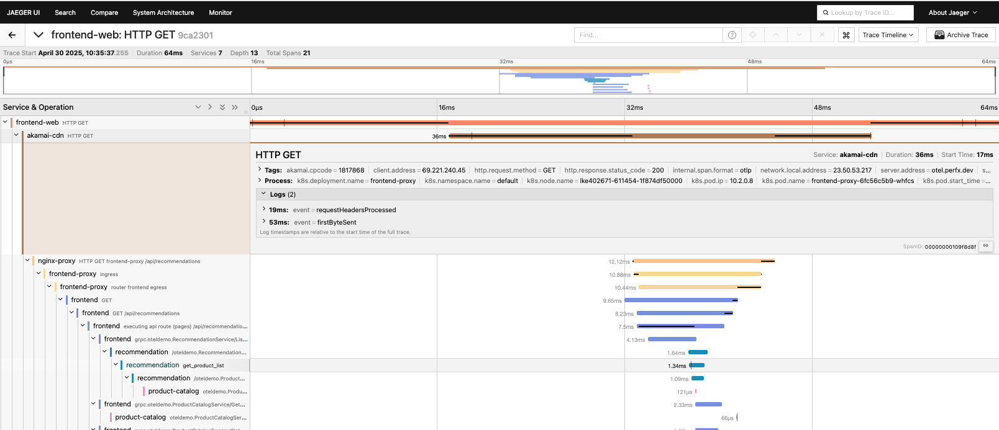

# DataStream2 to OTEL Bridge

This is a Spin Wasm function that acts as a bridge between [DataStream2](https://techdocs.akamai.com/datastream2/docs/welcome-datastream2)
and an OTLP collector.



The DS2 receiver is exposed as `/v1/api/datastream2`. DS2 logs will be converted to Open Telemetry spans, and delivered to the endpoint defined in the `otlp_endpoint` variable, using OTLP/HTTP with JSON encoding.

The Akamai CDN configuration should provide a custom field with data formatted similarly to a URL query string.  (e.g.`tid=0123456789abcdef0123456789abcdef&sid=0123456789abcdef&pid=0123456789abcdef&ms=1746023215038`)

* tid: transaction ID (32 hex characters)
* sid: span ID of the Akamai-generated span (16 hex characters)
* pid (optional): parent span ID, if a parent span is provided from the incoming request (16 hex characters)
* ms (optional): timestamp with millisecond granularity.  If not provided, the default DS2 timestamp will be used, with a 1-second granularity.  This can be retrieved by reading `AK_CURRENT_TIME_MS` in advanced metadata.  Contact your Akamai Professional Services team for support.

### Building, running locally, deploying

```bash
spin build
spin up
spin aka deploy y --variable otlp_endpoint=https://otel-receiver.example.com/otlp-http/v1/traces
```


